import { CardGrid, LinkCard, Card } from "@astrojs/starlight/components";

AtmosFioreは、室内空間特有の「光の差し込み」「空気感」をDirectX 11上でフォトリアルに描き出すカスタムレンダリングパイプラインです。
このセクションでは、本シェーダーエンジンを構成する主要な技術について詳細なアルゴリズムとコード（HLSL/C++）の解説を提供します。

---

## 🎨 レンダリングパイプライン

AtmosFioreは、複雑なマテリアルと高精度な反射を両立させるため、以下のパイプラインに沿って描画処理を行っています。

```mermaid
graph TD
    A[1. ジオメトリパス G-Buffer生成] --> B[2. ライティングパス]
    B --> C[3. IBL / シャドウマッピング]
    C --> D[4. ポストプロセス Bloom / Tone Mapping / Adaptation]
    D --> E[最終画面出力]
    style B fill:#451a03,stroke:#f59e0b,stroke-width:2px
    style C fill:#1e3a8a,stroke:#3b82f6,stroke-width:2px
    style D fill:#064e3b,stroke:#10b981,stroke-width:2px
```

---

## 🔧 主要技術の個別解説

<CardGrid>

<Card title="Physical Material (PBR)" icon="setting">
  大理石の微細な鏡面反射、木材の微細な吸光、遮光カーテンの半透過（SSS）を物理的に正しく定義。室内の質感をリアルに描き分けます。
  <LinkCard title="PBRの実装技術を見る" href="./pbr/" />
</Card>

<Card title="Image-Based Lighting (IBL)" icon="lightbulb">
  HDR環境マップを用いた物理的に正確な環境光のシミュレーション。窓から差し込む光のバウンスを表現します。
  <LinkCard title="IBLの実装技術を見る" href="./ibl/" />
</Card>

<Card title="Shadow Mapping" icon="moon">
  ライト視点からの深度情報を用いたリアルタイム影の描画。ポイントライト、ディレクショナルライトの影を高精度に表現します。
  <LinkCard title="Shadow Mappingの実装技術を見る" href="./shadow-mapping/" />
</Card>

<Card title="Bloom" icon="sparkles">
  高輝度部分の抽出とガウシアンブラーによる発光表現。窓からの直射光の発光をリアルに表現します。
  <LinkCard title="Bloomの実装技術を見る" href="./bloom/" />
</Card>

<Card title="Tone Mapping" icon="adjust">
  HDRレンダリングされた高輝度カラーをSDRディスプレイに適切に表示するためのトーンマッピング。ACES Filmic Tone Mappingなど多数のアルゴリズムを実装。
  <LinkCard title="Tone Mappingの実装技術を見る" href="./tone-mapping/" />
</Card>

<Card title="Adaptation（自動露出）" icon="eye">
  シーンの輝度に応じた自動露出調整による目の順応シミュレーション。暗い場所から明るい場所への移動時の目の順応を再現。
  <LinkCard title="Adaptationの実装技術を見る" href="./adaptation/" />
</Card>

<Card title="Deferred Lighting" icon="layers">
  G-Bufferを用いたライティング計算の分離による効率的な複数光源処理。ディファードライティングパイプラインの実装。
  <LinkCard title="Deferred Lightingの実装技術を見る" href="./deferred-lighting/" />
</Card>

<Card title="G-Buffer" icon="database">
  ディファードライティングで使用する幾何情報を格納するバッファ構造。法線、アルベド、金属度、粗さ、位置、AO、エミッシブを格納。
  <LinkCard title="G-Bufferの実装技術を見る" href="./gbuffer/" />
</Card>

<Card title="Area Light（LTC）" icon="panel-top">
  LTC（Linearly Transformed Cosines）によるエリアライティングの実装。面光源（窓、パネルライト）からの光をリアルタイムにシミュレート。
  <LinkCard title="Area Lightの実装技術を見る" href="./area-light/" />
</Card>

<Card title="Point Light" icon="point">
  点光源からの光をリアルタイムにシミュレートするポイントライトの実装。ランプ、電球のような点光源をリアルに表現。
  <LinkCard title="Point Lightの実装技術を見る" href="./point-light/" />
</Card>

<Card title="Spot Light" icon="flashlight">
  方向性を持つ点光源からの光をリアルタイムにシミュレートするスポットライトの実装。スポットライト、懐中電灯のような方向性を持つ光源をリアルに表現。
  <LinkCard title="Spot Lightの実装技術を見る" href="./spot-light/" />
</Card>

<Card title="Directional Light" icon="sun">
  平行光（太陽光など）をリアルタイムにシミュレートするディレクショナルライトの実装。直交投影によるシャドウマッピング。
  <LinkCard title="Directional Lightの実装技術を見る" href="./directional-light/" />
</Card>

<Card title="Audio Engine" icon="volume-high">
  ゲーム内のオーディオ再生を管理するオーディオエンジンのアーキテクチャ。オーディオグラフ、DSPノード、ストリーミング再生、3D空間オーディオを実装。
  <LinkCard title="Audio Engineの実装技術を見る" href="./audio-engine/" />
</Card>

</CardGrid>
