import { CardGrid, LinkCard, Card } from "@astrojs/starlight/components";

AtmosFioreは、室内空間特有の「光の差し込み」「空気感」をDirectX 11上でフォトリアルに描き出すカスタムレンダリングパイプラインです。
このセクションでは、本シェーダーエンジンを構成する主要な技術について詳細なアルゴリズムとコード（HLSL/C++）の解説を提供します。

---

## 🎨 レンダリングパイプライン

AtmosFioreは、複雑なマテリアルと高精度な反射を両立させるため、以下のパイプラインに沿って描画処理を行っています。

```mermaid
graph TD
    A[1. ジオメトリパス G-Buffer生成] --> B[2. ライティングパス]
    B --> C[3. IBL / シャドウマッピング]
    C --> D[4. ポストプロセス Bloom / Tone Mapping / Adaptation]
    D --> E[最終画面出力]
    style B fill:#451a03,stroke:#f59e0b,stroke-width:2px
    style C fill:#1e3a8a,stroke:#3b82f6,stroke-width:2px
    style D fill:#064e3b,stroke:#10b981,stroke-width:2px
```

---

## 🔧 主要技術の個別解説

<CardGrid>
<Card title="Tone Mapping" icon="adjust">
  HDRレンダリングされた高輝度カラーをSDRディスプレイに適切に表示するためのトーンマッピング。ACES Filmic Tone Mappingなど多数のアルゴリズムを実装。
  <LinkCard title="Tone Mappingの実装技術を見る" href="./tone-mapping/" />
</Card>

</CardGrid>
