import { Aside, LinkCard, CardGrid, Card } from "@astrojs/starlight/components";
import ImageGrid from "../../../components/ImageGrid.astro";
import dummyImg from "../../../assets/dummy.jpg";

AtmosFioreでは、Deferred Lightingで生成されたHDRシーンカラーに対し、12種類のポストエフェクトを決められた順序で連鎖適用する **Post_Process_Manager** がレンダリングパイプラインの最終工程を担っています。各エフェクトは「前段の出力SRVを受け取り、自身の出力SRVを返す」というバケツリレー方式で疎結合に接続されており、エフェクトの追加・削除・順序変更が容易な設計になっています。

---

## 📐 設計思想

- **単一責任のフルスクリーンパス**：各エフェクトクラス（`bloom` / `Fog` / `Adaptation` など）は、コンストラクタで自身専用のフレームバッファとピクセルシェーダーを保持し、`make()` 一発でHDR入力→HDR（またはSDR）出力を完結させます。
- **静的シングルトン的な管理**：`Post_Process_Manager` 自体はすべてのメンバ関数が `static` で、エンジン全体から `Post_Process_Manager::draw()` のように直接呼び出せます。
- **状態退避・復元の徹底**：各エフェクトの `make()` 内部では、深度ステンシル・ラスタライザ・ブレンドステート・シェーダーリソースビューを呼び出し前に退避し、処理後に必ず復元することで、他の描画パス（ImGuiやシーン描画）に副作用を与えません。

---

## 🖼️ パイプライン全体のデモ

<ImageGrid images={[dummyImg.src]} />

---

## 🔗 パイプライン構成

```mermaid
graph TD
    A[Deferred Lighting Pass] --> B[Sky]
    B --> C[VolumetricFog]
    C --> D[HeightFog]
    D --> E[DistanceFog]
    E --> F[ExponentialFog]
    F --> G[Depth of Field]
    G --> H[Exposure]
    H --> I[Chromatic Aberration]
    I --> J[Lens Distortion]
    J --> K[Vignetting]
    K --> L[Bloom]
    L --> M[Adaptation]
    M --> N[Tone Mapping]
    N --> O[最終画面出力]
    style G fill:#1e3a8a,stroke:#3b82f6,stroke-width:2px
    style L fill:#451a03,stroke:#f59e0b,stroke-width:2px
    style N fill:#064e3b,stroke:#10b981,stroke-width:2px
```



フォグ→被写界深度の順にしているのは、ボケの縁にフォグが自然に馴染むようにするためです。逆に露出・色収差・歪曲・周辺減光・Bloomはすべて「レンズ／カメラ由来の効果」としてDoFの後段にまとめ、最後にAdaptation（自動露出）とTone Mappingで画面全体の見え方を確定させています。

---

## 💻 C++実装：管理クラスの骨格

```cpp
class Post_Process_Manager {
public:
	Post_Process_Manager() = default;
	~Post_Process_Manager() = default;

	static void initialize();
	static void update(float elapsedtime);
	static void begin();
	static void end();
	static void draw();
	static void render();
	static void renderGUI();

public:
	bloom& GetBloom() { return *bloomer; }
	Fog& GetFog() { return *fogger; }
	shadow& GetShadow() { return *shadower; }
	Adaptation& GetAdaptation() { return *adaptation; }
	ToneMapping& GetToneMapping() { return *tone_mapper; }
	DepthOfField& GetDof() { return *dofer; }
	Exposure& GetExposure() { return *exposurer; }
	ChromaticAberration& GetChromaticAberration() { return *ca_effect; }
	LensDistortion& GetLensDistortion() { return *lens_distortion; }
	Vignetting& GetVignetting() { return *vignetting; }

	VolumetricFog& GetVolumetricFog() { return *vol_fog; }
	HeightFog& GetHeightFog() { return *hgt_fog; }
	DistanceFog& GetDistanceFog() { return *dst_fog; }
	ExponentialFog& GetExponentialFog() { return *exp_fog; }

private:
	static Framebuffer fsquad;

	static std::unique_ptr<bloom>               bloomer;
	static std::unique_ptr<Fog>                 fogger;
	static std::unique_ptr<shadow>              shadower;
	static std::unique_ptr<Adaptation>          adaptation;
	static std::unique_ptr<ToneMapping>         tone_mapper;
	static std::unique_ptr<DepthOfField>        dofer;
	static std::unique_ptr<Sky>                 skyer;
	static std::unique_ptr<Exposure>            exposurer;
	static std::unique_ptr<ChromaticAberration> ca_effect;
	static std::unique_ptr<LensDistortion>      lens_distortion;
	static std::unique_ptr<Vignetting>          vignetting;
	static std::unique_ptr<VolumetricFog>       vol_fog;
	static std::unique_ptr<HeightFog>           hgt_fog;
	static std::unique_ptr<DistanceFog>         dst_fog;
	static std::unique_ptr<ExponentialFog>      exp_fog;
};
```

---

## 💻 C++実装：パイプライン実行 (`draw`)

```cpp
void Post_Process_Manager::draw()
{
	auto* ctx = Graphics_Core::instance().get_device_context();

	// 1. Sky
	skyer->make(ctx, fsquad.GetColorMap());

	// 2. VolumetricFog（Sky直後 = HDR生輝度に対してフォグを乗せる）
	vol_fog->make(ctx, skyer->get_color_map());

	// 3. HeightFog
	hgt_fog->make(ctx, vol_fog->get_color_map());

	// 4. DistanceFog
	dst_fog->make(ctx, hgt_fog->get_color_map());

	// 5. ExponentialFog
	exp_fog->make(ctx, dst_fog->get_color_map());

	// 6. DoF（フォグ後に被写界深度を適用することでボケ端にフォグが馴染む）
	dofer->make(ctx, exp_fog->get_color_map());

	// 7. Exposure
	exposurer->make(ctx, dofer->GetColorMap());

	// 8. ChromaticAberration
	ca_effect->make(ctx, exposurer->GetColorMap());

	// 9. LensDistortion
	lens_distortion->make(ctx, ca_effect->GetColorMap());

	// 10. Vignetting
	vignetting->make(ctx, lens_distortion->GetColorMap());

	// 11. Bloom
	bloomer->make(ctx, vignetting->GetColorMap());

	// 12. Adaptation（自動露出）
	adaptation->make(ctx, bloomer->getColorMap());

	// 13. ToneMapping
	tone_mapper->make(ctx, adaptation->get_color_map());
}

void Post_Process_Manager::render()
{
	// Tone Mapping済みのSDRバッファをバックバッファへフルスクリーン転送
	Graphics_Core::instance().get_fullscreen_quad()->Blit(
		Graphics_Core::instance().get_device_context(),
		tone_mapper->get_color_map_address(), 0, 1
	);
}
```

---

## 🎨 処理の詳細

### 1. バケツリレー方式の接続

各エフェクトの `make(ctx, prev->GetColorMap())` を呼び出すだけで、前段の結果を次段の入力として自動的に受け渡せます。エフェクトごとに独立したフレームバッファを持つため、中間結果をImGui上でいつでもプレビュー・デバッグできます。

### 2. `begin()` / `end()` によるライティングパスの分離

```cpp
void Post_Process_Manager::begin()
{
	auto* ctx = Graphics_Core::instance().get_device_context();

	fsquad.Clear(ctx, 0.5f, 0.5f, 0.5f, 1.0f);
	fsquad.Activate(ctx, Graphics_Core::instance().get_geometry_buffer()->GetDepthStencilView());

	ID3D11ShaderResourceView* srvs[GBUFFER_COUNT + 3]{};
	Graphics_Core::instance().get_geometry_buffer()->GetShaderResourceViews(srvs);
	srvs[GBUFFER_COUNT + 0] = shadower->get_point_shadow_front_map();
	srvs[GBUFFER_COUNT + 1] = shadower->get_point_shadow_back_map();
	srvs[GBUFFER_COUNT + 2] = shadower->get_directional_shadow_map();

	Graphics_Core::instance().get_fullscreen_quad()->Blit(
		ctx, srvs, 0, GBUFFER_COUNT + 3,
		Resource_Manager::instance().shader_manager.GetNative<Pixel_Shader>("DEFERRED_LIGHTING_PS")
	);
}
```

G-Bufferとシャドウマップを合成してディファードライティングを行うのが `begin()` の役割で、その結果（`fsquad`）がポストエフェクトパイプライン最初の入力になります。

### 3. `update()` による時間依存パラメータの一括更新

```cpp
void Post_Process_Manager::update(float elapsedtime)
{
	fogger->fog_constans.Time += elapsedtime;
	adaptation->delta_time = elapsedtime;
	skyer->time += elapsedtime;
	hgt_fog->config.time += elapsedtime;
	vol_fog->config.time += elapsedtime;
}
```

Sky・フォグ系のノイズアニメーションやAdaptationの順応速度など、フレーム時間に依存するパラメータをここで一括更新し、各エフェクトの `make()` はステートレスに保っています。

---

## 🔧 実装のポイント

### 1. 疎結合な依存関係

各エフェクトクラスは互いを直接参照せず、`Post_Process_Manager` がSRVの受け渡しのみを仲介します。これにより、たとえば「DoFを外してExposureを直接Bloomに繋ぐ」といったパイプライン改変を `draw()` 側の数行だけで完結できます。

### 2. デバッグGUIとの統合

`renderGUI()` 系のメソッド（`drawBloomGUI()` / `drawAdaptationGUI()` / `drawToneMappingGUI()` など）が、各エフェクトの中間バッファをImGui上にプレビュー表示しつつパラメータ調整できるようにしており、開発中のビジュアルデバッグを高速化しています。

### 3. リソース状態の完全な退避・復元

各エフェクトの `make()` はDirectX 11のステートフルAPIを直接操作するため、呼び出し前後でSRV・深度ステンシルステート・ラスタライザステート・ブレンドステートを退避／復元しないと、他の描画パスに副作用が漏れます。AtmosFioreの全エフェクトはこの規約を徹底しています。

<Aside type="note">
  各エフェクトの詳細な実装（アルゴリズム・HLSLコード）は、下記の個別記事で解説しています。
</Aside>

<Aside type="caution">
  パイプラインの順序を変更する際は、後段のエフェクトが前提とする入力の性質（HDRかSDRか、線形かガンマ済みかなど）に注意する必要があります。特にTone Mappingは必ず最終段に配置してください。
</Aside>

---

## 🔧 関連する個別エフェクト

<CardGrid>
<Card title="Sky" icon="moon"><LinkCard title="Skyの実装詳細" href="./sky/" /></Card>
<Card title="Fog System" icon="rocket"><LinkCard title="Fogの実装詳細" href="./fog/" /></Card>
<Card title="Depth of Field" icon="magnifier"><LinkCard title="DoFの実装詳細" href="./dof/" /></Card>
<Card title="Exposure" icon="seti:image"><LinkCard title="Exposureの実装詳細" href="./exposure/" /></Card>
<Card title="Chromatic Aberration" icon="approve-check"><LinkCard title="色収差の実装詳細" href="./chromatic-aberration/" /></Card>
<Card title="Lens Distortion" icon="seti:lock"><LinkCard title="レンズ歪曲の実装詳細" href="./lens-distortion/" /></Card>
<Card title="Vignetting" icon="seti:image"><LinkCard title="周辺減光の実装詳細" href="./vignetting/" /></Card>
<Card title="Bloom" icon="sparkles"><LinkCard title="Bloomの実装詳細" href="./bloom/" /></Card>
<Card title="Adaptation" icon="eye"><LinkCard title="自動露出の実装詳細" href="./adaptation/" /></Card>
<Card title="Tone Mapping" icon="adjust"><LinkCard title="Tone Mappingの実装詳細" href="./tone-mapping/" /></Card>
</CardGrid>
